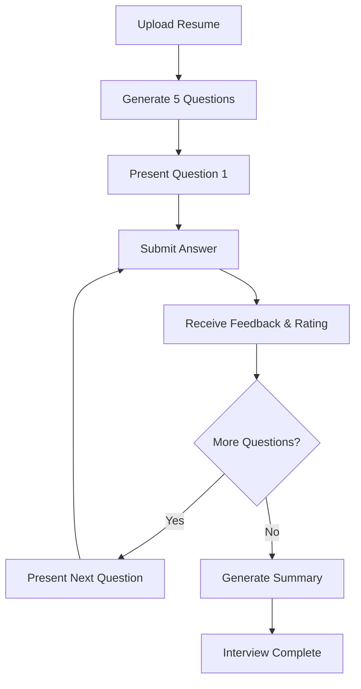

# Interview Assistant API Documentation

## Overview
The Interview Assistant API provides endpoints for conducting AI-powered mock interviews based on uploaded resumes. The system generates customized questions, analyzes answers, provides feedback, and creates comprehensive performance summaries.

## Base URL
```
http://localhost:8000/api/
```

## Authentication
Currently, the interview endpoints do not require authentication. Future versions will include JWT authentication.

## Endpoints

### 1. Start Interview Session
Initiates a new interview session by uploading a resume and receiving the first question.

**Endpoint:** `POST /api/interview/start`

**Request:**
- Method: `POST`
- Content-Type: `multipart/form-data`

**Request Body:**
| Field | Type | Required | Description |
|-------|------|----------|-------------|
| resume | File | Yes | PDF file of the resume (max 10MB) |

**Response (201 Created):**
```json
{
    "message": "Interview started successfully",
    "session_id": "123e4567-e89b-12d3-a456-426614174000",
    "total_questions": 5,
    "current_question": 1,
    "question": "Tell me about your experience with microservices architecture.",
    "question_audio": "base64_encoded_audio_string..."
}
```

**Error Responses:**
- `400 Bad Request`: Invalid PDF, empty content, or file too large
- `503 Service Unavailable`: Failed to generate questions (AI service error)

**Example cURL:**
```bash
curl -X POST http://localhost:8000/api/interview/start \
  -F "resume=@/path/to/resume.pdf"
```

---

### 2. Submit Answer
Submit an answer to the current interview question and receive feedback.

**Endpoint:** `POST /api/interview/answer`

**Request:**
- Method: `POST`
- Content-Type: `application/json`

**Request Body:**
| Field | Type | Required | Description |
|-------|------|----------|-------------|
| session_id | UUID | Yes | Interview session identifier |
| answer | String | Conditional | Text answer (required if no audio) |
| audio | String | Conditional | Base64 encoded audio (required if no text) |

**Note:** Either `answer` (text) or `audio` (base64) must be provided, but not both.

**Response (200 OK) - More Questions Remaining:**
```json
{
    "message": "Answer recorded successfully",
    "session_id": "123e4567-e89b-12d3-a456-426614174000",
    "current_question": 2,
    "total_questions": 5,
    "transcribed_answer": "I led the migration of our monolithic application...",
    "feedback": "Excellent answer! You demonstrated specific experience...",
    "feedback_audio": "base64_encoded_audio_string...",
    "rating": 8,
    "is_complete": false,
    "next_question": "How did you handle scaling challenges?",
    "next_question_audio": "base64_encoded_audio_string...",
    "next_question_number": 3
}
```

**Response (200 OK) - Interview Complete:**
```json
{
    "message": "Interview completed!",
    "session_id": "123e4567-e89b-12d3-a456-426614174000",
    "current_question": 5,
    "total_questions": 5,
    "transcribed_answer": "My approach to learning new technologies...",
    "feedback": "Good answer with concrete examples...",
    "feedback_audio": "base64_encoded_audio_string...",
    "rating": 7,
    "is_complete": true,
    "next_question": null,
    "next_question_audio": null
}
```

**Error Responses:**
- `400 Bad Request`: Invalid input, audio too large, or session already completed
- `404 Not Found`: Session ID not found
- `500 Internal Server Error`: Failed to process answer or transcribe audio

**Example cURL (Text Answer):**
```bash
curl -X POST http://localhost:8000/api/interview/answer \
  -H "Content-Type: application/json" \
  -d '{
    "session_id": "123e4567-e89b-12d3-a456-426614174000",
    "answer": "I have 5 years of experience with microservices..."
  }'
```

**Example cURL (Audio Answer):**
```bash
curl -X POST http://localhost:8000/api/interview/answer \
  -H "Content-Type: application/json" \
  -d '{
    "session_id": "123e4567-e89b-12d3-a456-426614174000",
    "audio": "UklGRiQAAABXQVZFZm10IBAAAAABAAEARKwAAA..."
  }'
```

---

### 3. Get Interview Summary
Retrieve the complete interview summary including all Q&A pairs and performance analysis.

**Endpoint:** `GET /api/interview/summary/<session_id>`

**Request:**
- Method: `GET`
- URL Parameter: `session_id` (UUID)

**Response (200 OK) - Interview Complete:**
```json
{
    "session_id": "123e4567-e89b-12d3-a456-426614174000",
    "status": "completed",
    "total_questions": 5,
    "average_rating": 7.4,
    "qa_pairs": [
        {
            "question_number": 1,
            "question": "Tell me about your experience with microservices.",
            "answer": "I led the migration of our monolithic application...",
            "feedback": "Excellent answer demonstrating leadership...",
            "rating": 8
        },
        {
            "question_number": 2,
            "question": "How do you handle technical challenges?",
            "answer": "I approach challenges systematically...",
            "feedback": "Good structured approach...",
            "rating": 7
        }
    ],
    "summary": "OVERALL PERFORMANCE:\nThe candidate demonstrated strong technical knowledge with an average score of 7.4/10...\n\nSTRENGTHS:\n- Excellent communication skills\n- Deep technical expertise...\n\nAREAS FOR IMPROVEMENT:\n- Could provide more specific metrics...\n\nRECOMMENDATIONS:\n- Practice STAR method for behavioral questions...\n\nFINAL SCORE: 7.4/10",
    "created_at": "2024-01-15T10:30:00Z"
}
```

**Response (200 OK) - Interview In Progress:**
```json
{
    "session_id": "123e4567-e89b-12d3-a456-426614174000",
    "status": "in_progress",
    "current_question": 3,
    "total_questions": 5,
    "message": "Interview is still in progress.",
    "average_rating": 7.5,
    "qa_pairs": [
        {
            "question_number": 1,
            "question": "Tell me about your experience...",
            "answer": "I have extensive experience...",
            "feedback": "Great answer...",
            "rating": 8
        }
    ],
    "summary": null
}
```

**Error Responses:**
- `404 Not Found`: Session ID not found or invalid

**Example cURL:**
```bash
curl -X GET http://localhost:8000/api/interview/summary/123e4567-e89b-12d3-a456-426614174000
```

---

## Data Formats

### Audio Format
- **Input:** Base64 encoded audio (MP3, WAV, or similar formats)
- **Output:** Base64 encoded MP3 audio
- **Max Size:** 5MB for input audio

### Resume Requirements
- **Format:** PDF only
- **Max Size:** 10MB
- **Min Content:** At least 100 characters of extractable text
- **Recommended:** Include skills, experience, education, and projects

### Rating Scale
Answers are rated on a 1-10 scale:
- **1-3:** Poor (vague, off-topic, or no substance)
- **4-5:** Below Average (partially relevant but lacks depth)
- **6-7:** Good (relevant and reasonably detailed)
- **8-9:** Very Good (specific, well-structured, demonstrates expertise)
- **10:** Excellent (exceptional depth, concrete examples, perfect delivery)

## Interview Flow



## Error Handling

All error responses follow this format:
```json
{
    "message": "Human-readable error description",
    "error": "Technical error details (optional)",
    "errors": {
        "field_name": ["Validation error message"]
    }
}
```

## Rate Limiting
Currently no rate limiting is implemented. Future versions will include:
- 10 interviews per hour per IP address
- 100 interviews per day per authenticated user

## WebSocket Support (Future)
Future versions will include WebSocket support for real-time interview sessions at `ws://localhost:8000/ws/interview/`.

## SDK Examples

### Python
```python
import requests
import base64

# Start interview
with open('resume.pdf', 'rb') as f:
    response = requests.post(
        'http://localhost:8000/api/interview/start',
        files={'resume': f}
    )
    session_data = response.json()
    session_id = session_data['session_id']

# Submit text answer
answer_response = requests.post(
    'http://localhost:8000/api/interview/answer',
    json={
        'session_id': session_id,
        'answer': 'My answer to the question...'
    }
)

# Get summary
summary_response = requests.get(
    f'http://localhost:8000/api/interview/summary/{session_id}'
)
```

### JavaScript/Node.js
```javascript
const FormData = require('form-data');
const fs = require('fs');
const axios = require('axios');

// Start interview
const form = new FormData();
form.append('resume', fs.createReadStream('resume.pdf'));

const { data } = await axios.post(
    'http://localhost:8000/api/interview/start',
    form,
    { headers: form.getHeaders() }
);

const sessionId = data.session_id;

// Submit answer
const answerResponse = await axios.post(
    'http://localhost:8000/api/interview/answer',
    {
        session_id: sessionId,
        answer: 'My answer to the question...'
    }
);

// Get summary
const summaryResponse = await axios.get(
    `http://localhost:8000/api/interview/summary/${sessionId}`
);
```

## Postman Collection
A Postman collection for testing these endpoints is available at `/postman/interview-assistant-api.json`.

## Support
For issues or questions, please contact the development team or open an issue in the project repository.